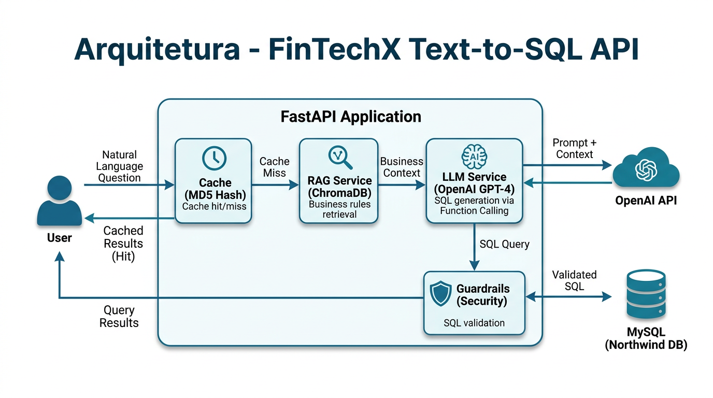

# FinTechX - Text-to-SQL LLM API

API inteligente que traduz perguntas em linguagem natural para consultas SQL, utilizando **GPT-4-turbo**, **Function Calling**, **RAG (ChromaDB)**, **Cache Inteligente** e **Guardrails de Segurança**. Conecta-se ao banco de dados Northwind (MySQL) e foi projetada com foco em escala, confiabilidade e custo operacional.

> **Deploy em produção:** [https://fintechx-llm-api.onrender.com](https://fintechx-llm-api.onrender.com)

---

## Arquitetura da Solução



O documento completo de arquitetura, com decisões técnicas e estratégias de escalabilidade, está em [ARCHITECTURE.MD](./ARCHITECTURE.MD).

### Pipeline da Requisição

```
Pergunta (linguagem natural)
    │
    ▼
┌─────────────────────┐
│  1. CACHE (MD5)     │ ──── HIT? ──── Pula direto para etapa 5
│  Verifica se a       │
│  pergunta já foi     │
│  processada          │
└─────────┬───────────┘
          │ MISS
          ▼
┌─────────────────────┐
│  2. RAG (ChromaDB)  │  Busca regras de negócio relevantes
│  Busca vetorial de   │  (ex: "ticket médio", "cliente corporativo")
│  contexto de negócio │  via similaridade semântica
└─────────┬───────────┘
          │
          ▼
┌─────────────────────┐
│  3. LLM (GPT-4)     │  Gera SQL via Function Calling
│  Prompt = Schema +   │  Retorno estruturado: {sql_query, explanation}
│  Contexto RAG        │  temperature=0.0 para determinismo
└─────────┬───────────┘
          │
          ▼
┌─────────────────────┐
│  4. GUARDRAILS       │  Valida: só SELECT/WITH, sem DDL/DML,
│  Validação SQL       │  apenas tabelas do Northwind
└─────────┬───────────┘
          │
          ▼
┌─────────────────────┐
│  5. MySQL            │  Executa SQL e retorna dados em tempo real
│  (Northwind DB)      │
└─────────────────────┘
```

### Técnicas Utilizadas

| Técnica | Implementação |
|---------|--------------|
| **Prompt Engineering** | System prompt com schema completo do banco (tabelas, colunas, relacionamentos) |
| **Function Calling** | `tool_choice` forçado para retorno JSON estruturado `{sql_query, explanation}` |
| **RAG** | ChromaDB com 10 regras de negócio + OpenAI embeddings (`text-embedding-3-small`) |
| **Busca Vetorial** | Similaridade semântica para recuperar top-2 regras mais relevantes por pergunta |
| **Cache Inteligente** | Hash MD5 da pergunta normalizada, TTL de 24h, cacheia SQL (não dados) |
| **Guardrails** | Regex para DDL/DML + validação de tabelas permitidas + obrigatoriedade de SELECT/WITH |

---

## Como Executar Localmente

### Pré-requisitos

- **Python 3.10+** instalado
- **Chave da API da OpenAI** com créditos disponíveis

### Passo 1: Clonar o repositório

```bash
git clone https://github.com/alanmolter/fintechx-llm-api.git
cd fintechx-llm-api
```

### Passo 2: Criar e ativar o ambiente virtual

```bash
python -m venv venv
```

No **Windows**:
```bash
venv\Scripts\activate
```

No **Linux/Mac**:
```bash
source venv/bin/activate
```

### Passo 3: Instalar dependências

```bash
pip install -r requirements.txt
```

### Passo 4: Configurar variáveis de ambiente

Copie o arquivo de exemplo e edite com sua chave da OpenAI:

```bash
cp .env.example .env
```

Edite o `.env` e substitua o valor de `LLM_API_KEY`:

```
DB_HOST=northwind-mysql-db.ccghzwgwh2c7.us-east-1.rds.amazonaws.com
DB_PORT=3306
DB_USER=user_read_only
DB_PASS=laborit_teste_2789
DB_NAME=northwind
LLM_API_KEY=sua_chave_openai_aqui
```

### Passo 5: Iniciar a aplicação

```bash
uvicorn app.main:app --reload
```

### Passo 6: Acessar a API

- **Swagger (documentação interativa):** [http://localhost:8000/docs](http://localhost:8000/docs)
- **Health check:** [http://localhost:8000/health](http://localhost:8000/health)
- **Perguntas de exemplo:** [http://localhost:8000/api/v1/examples](http://localhost:8000/api/v1/examples)

### Exemplo de uso via curl

```bash
curl -X POST http://localhost:8000/api/v1/query \
  -H "Content-Type: application/json" \
  -d '{"question": "Quais são os produtos mais vendidos em termos de quantidade?"}'
```

---

## Testes Automatizados

O projeto possui **24 testes** cobrindo os guardrails de segurança SQL e o serviço de cache:

```bash
pytest tests/ -v
```

---

## CI/CD e Deploy

O projeto possui CI/CD automatizado via **GitHub Actions**:

1. **CI**: Instala dependências + executa `pytest` a cada push/PR na branch `main`.
2. **CD**: Aciona deploy automático no **Render** via webhook após os testes passarem.

---

## Estrutura do Projeto

```
fintechx-llm-api/
├── .github/workflows/deploy.yml   # Pipeline CI/CD (GitHub Actions)
├── .env.example                   # Template de variáveis de ambiente
├── .python-version                # Versão do Python para o Render (3.11)
├── ARCHITECTURE.MD                # Documento técnico de arquitetura
├── README.md                      # Este documento
├── requirements.txt               # Dependências Python
├── docs/
│   └── arquitetura.png            # Diagrama de arquitetura
├── app/
│   ├── main.py                    # Entry point FastAPI + rotas utilitárias
│   ├── core/
│   │   ├── config.py              # Configurações centralizadas (.env)
│   │   └── security.py            # Guardrails de validação SQL
│   ├── db/
│   │   ├── session.py             # Engine SQLAlchemy (pool de conexões)
│   │   └── repository.py          # Execução de queries no banco
│   ├── models/
│   │   └── schemas.py             # Modelos Pydantic (request/response)
│   ├── routers/
│   │   └── query.py               # Endpoints da API (pipeline principal)
│   └── services/
│       ├── llm_service.py         # OpenAI GPT-4-turbo + Function Calling
│       ├── rag_service.py         # ChromaDB + Busca Vetorial (RAG)
│       └── cache_service.py       # Cache inteligente em memória
└── tests/
    ├── test_security.py           # Testes dos guardrails SQL
    └── test_cache.py              # Testes do serviço de cache
```

---

## Perguntas de Exemplo

A API é capaz de responder perguntas analíticas como:

1. Quais são os produtos mais populares entre os clientes corporativos?
2. Quais são os produtos mais vendidos em termos de quantidade?
3. Qual é o volume de vendas por cidade?
4. Quais são os clientes que mais compraram?
5. Quais são os produtos mais caros da loja?
6. Quais são os fornecedores mais frequentes nos pedidos?
7. Quais os melhores vendedores?
8. Qual é o valor total de todas as vendas realizadas por ano?
9. Qual é o valor total de vendas por categoria de produto?
10. Qual o ticket médio por compra?

Além destas, a API aceita **qualquer pergunta analítica** sobre o banco Northwind.

---

Feito com dedicação por **Alan Molter** para o desafio do Círculo LAB.
